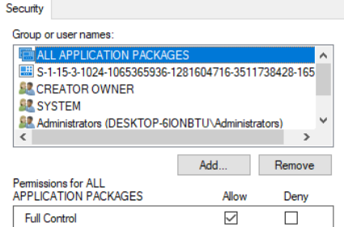

# Scalability Test Automated

## Requirements:
  1. [Python](https://www.python.org/downloads/)
  
  2. Python Modules
      ```bash
      pip install pywin32-ctypes
      pip install pywin32
      ```

## System Compatibility Requirements
  1. Registry Permissions:
  
      - Navigate to these path in Registry
        ```bash
        Computer\HKEY_LOCAL_MACHINE\SOFTWARE\ODBC
        Computer\HKEY_LOCAL_MACHINE\SOFTWARE\ODBC\ODBC.INI
        Computer\HKEY_LOCAL_MACHINE\SOFTWARE\ODBC\ODBCINST.INI
        ```
      Perform below mentioned steps for all the Registry folders given above.
      - Go to Permissions by right clicking on them
      - Allow `Full Control` for the current user & ALL APPLICATION PACKAGES
        
        

## Input:
  1. `Username`       - Simba/MagSW Username
  2. `Password`       - Simba/MagSW Password
  3. `BasePath`       - Current Working Directory Path (especially required to execute on Azure)
  4. `InputFileName`  - Name of Input File. i.e input.json (Extension must be .json)
        - Find more details about InputFile below
            1. `SourcePath` - Source Path of the package. Make sure to Map a network drive 
               and use it in the Virtual Machine if end execution would happen on a Virtual machine via Azure.  
               Refer this to [Map Network Drive](https://magnitudesoftware-my.sharepoint.com/:v:/g/personal/cjoshi_magsw_com/EZkVdUiiKNJKlORQQnR78vsBngNCkAEERs1YEBN3NqA_xw)
            2. `DestPath` - Path to extract the Package. It's advisable not to set it on Desktop due to permission issue while executing in a Virtual Machine via Azure
            3. `ForceUpdate` - Set true to download the Package even if it's present on the `DestPath` else false
            4. `Branch` - Branch of Core
            5. `Brand` - Plugin's Brand
            6. `WaitForUserToSetupDSN` - Set true to manually set up the Data Source Configurations. **Do not set it to true while running from Azure.** It would surely fail as Azure does not work in interactive environment.
            7. `DataSourceConfiguration` - Data Source Configuration in key value pair
  5. `ScalabilityTestConfigFilename` - Name (if in same Directory as the ScalabilityTestLauncher.py or prepend the path in which it is present) of the Config file which has the information for Scalability Testing i.e, scalabilityTestConfig.json (Extension must be .json)
        - Find more details about this Config file below   
            1. `ThreadCount` - Number of Threads required to be mentioned in the Script (Integer).
            2. `TestTimeInSeconds` - Time in Seconds for the Test (Integer)
            3. `NumberOfQueries` - Number of select Queries to be executed (Integer)
            4. `ConnString` - Optional Connection String for the Driver in case if you haven't provided the detials under the "Plugin" in input.json file (String)
            5. `provided` - Set true if provided a Connection String else set to false.

## Usage
- To Perform Scalability Test
     ```bash
     python ScalabilityTestLauncher.py username password C:fakepath input.json scalabilityTestConfig.json
     ```
  
